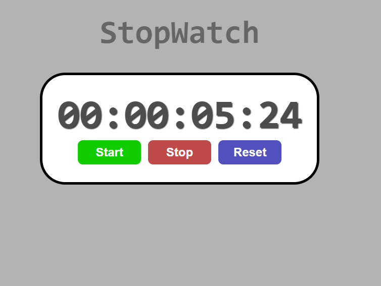

# stopWatch

## Overview

This is a straightforward web application that functions as a stopwatch, allowing users to start, stop, reset, and display elapsed time in hours, minutes, seconds, and milliseconds.

## App

